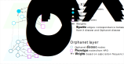

# Dream_Rare-X, Task 1 - MAGNET team

Anaïs Baudot, Cécile Beust, Galadriel Brière, Morgane Térézol

Aix*Marseille Université, INSERM, Marseille Medical Genetics, France

Aix*Marseille Université, CNRS, Marseille Mathematics Institute, France

Barcelona Supercomputing Center

## Prerequisities
- `jupyter-notebook`
- `python 3.10.9`
- Python packages:
    - `multixrank` (https://multixrank-doc.readthedocs.io/en/latest/)
    - `obonet` (https://pypi.org/project/obonet/)
    - `pyhpo` (https://pypi.org/project/pyhpo/)
    - `pandas`
    - `xml.etree.ElementTree`
    - `csv`
    - `networkx`
    - `glob`
    - `os`
    
## Run the pipeline
Go to the `jupyter-notebooks` folder, and run the following steps:

1) `step1_build_RAREX_layer.ipynb`
2) `step2_build_Orphanet_layer.ipynb`
3) `step3_build_bipartite_network.ipynb`
4) `step4_run_MultiXrank.ipynb`
5) `step5_parse_mxr_results.ipynb`
6) `step6_analyze_mxr_results.ipynb`

## Description of the pipeline

### Inroduction

Rare diseases often pose significant diagnostic challenges due to their low prevalence and the diversity of their associated symptoms. Gaining a more comprehensive perspective on the symptoms and phenotypes associated to rare diseases is crucial, as it could facilitates the early detection and more efficient management of these uncommon conditions.

In recent years, efforts have been made to organize the available knowledge about rare diseases. We can, for example, mention the Orphanet database `[1]`, which provides a classification of these rare diseases along with various information such as the mutated genes causing the disease and the associated phenotypes.

When analyzing a dataset of symptoms associated with a cohort of patients with various rare diseases, the incorporation of knowledge from public databases is essential to uncover new unrecognized symptoms that may potentially be linked to rare diseases. However, the diversity and heterogeneity of available information can make this task challenging.

Here, we propose to use multi-layer networks to represent this complex and heterogeneous information, as is has the potential to not only enhances the interpretability of the data but also provides a powerful framework for uncovering hidden patterns and relationships within the complex landscape of rare diseases, leveragging both the information contained in the input dataset and the knowledge contained in public databases.

In particular, Random Walk with Restart (RWR) approaches have demonstrated their utility in the analysis of complex biological networks  `[2]`. In these approaches, a *random walker* explores the network, starting from a specified *seed* node. As the *random walker* navigates the network, it computes scores for each node in the network, reflecting their proximity to the initial *seed*. Theses scores offer a valuable metric for assessing the influence and relevance of nodes within the network.

Recently, *MultiXrank*, a novel RWR algorithm for multi-layer networks, have been introduced `[3]`. 

MultiXrank is able to navigate very complex and heterogeneous networks, composed of various node types and interaction types. Here, we propose to use this algorithm on a two-layer network derived from the symptom dataset provied in the Rare-X challenge, supplemented by information extracted from the rare disease database Orphanet and the Human Phenotype Ontology (HPO) database `[4]`. We expect that the iterative application of MultiXrank, starting from each *Rare-X disease* seed node on the multi-layer network, will yield RWR scores that effectively highlight the significance of *symptom* and *phenotype* nodes with respect to the respective seed disease.

### Description of the pipeline

#### **Building the *Rare-X*-*Orphanet* multi-layer network**

The first three steps of the pipeline consist in building the multi-layer network represented in the figure below.

1) The Rare-X layer

The first layer, here after refered to as the *Rare-X layer* contains information extracted from the *Rare-X* dataset of symptoms associated to a cohort of rare disease patients. This layer contains three node types: 
- *Rare-X disease* nodes
- *Patient* nodes
- *Symptom* nodes

Every *Patient* node is linked to the corresponding *Rare-X disease* as reported in the dataset. We establish a weight of `1` for each *Patient*-*Rare-X disease* connection. Additionally, *Patient* nodes connect to *Symptom* nodes based on the symptoms documented in the dataset. In the case of *boolean* symptoms, where the symptom is either present or absent, we only report the presence of the symptom with an edge weighted `1`. For symptoms associated with scores, such as *CSHQ* symptoms, we report the normalized score as the edge weight.

The code used to generate the Rare-X layer is available in the `step1_build_RAREX_layer.ipynb` jupyter-notebook.

2) The Orphanet layer

### References

`[1]` Orphanet: an online database of rare diseases and orphan drugs. Copyright, INSERM 1997. Available at http://www.orpha.net Accessed 08/10/2023.

`[2]` Valdeolivas, Alberto, Laurent Tichit, Claire Navarro, Sophie Perrin, Gaëlle Odelin, Nicolas Levy, Pierre Cau, Elisabeth Remy, and Anaïs Baudot. “Random Walk with Restart on Multiplex and Heterogeneous Biological Networks.” Bioinformatics 35, no. 3 (February 1, 2019): 497–505. https://doi.org/10.1093/bioinformatics/bty637.

`[3]` Baptista, Anthony, Aitor Gonzalez, and Anaïs Baudot. “Universal Multilayer Network Exploration by Random Walk with Restart.” Communications Physics 5, no. 1 (July 1, 2022): 1–9. https://doi.org/10.1038/s42005-022-00937-9.

`[4]` Köhler, Sebastian, Michael Gargano, Nicolas Matentzoglu, Leigh C Carmody, David Lewis-Smith, Nicole A Vasilevsky, Daniel Danis, et al. “The Human Phenotype Ontology in 2021.” Nucleic Acids Research 49, no. D1 (January 8, 2021): D1207–17. https://doi.org/10.1093/nar/gkaa1043.
