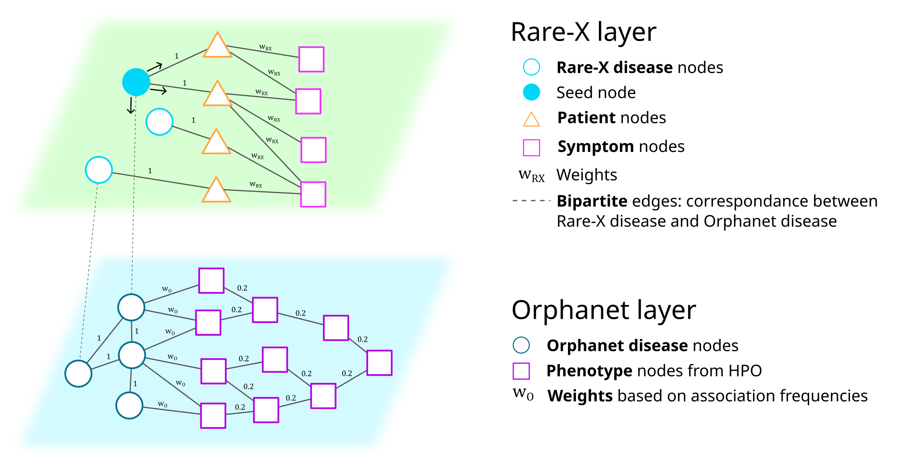

# Dream_Rare-X, Task 1 - MAGNET team

Anaïs Baudot, Cécile Beust, Galadriel Brière, Morgane Térézol

Aix*Marseille Université, INSERM, Marseille Medical Genetics, France

Aix*Marseille Université, CNRS, Marseille Mathematics Institute, France

Barcelona Supercomputing Center

## Prerequisities
- `jupyter-notebook`
- `python 3.10.9`
- Python packages:
    - `multixrank==0.1` (https://multixrank-doc.readthedocs.io/en/latest/)
    - `obonet` (https://pypi.org/project/obonet/)
    - `pyhpo==3.2.2` (https://pypi.org/project/pyhpo/)
    - `pandas`
    - `xml.etree.ElementTree`
    - `csv`
    - `networkx`
    - `glob`
    - `os`
    
## Run the pipeline
Go to the `jupyter-notebooks` folder, and run the following steps:

1) `step1_Build_RareX_Layer.ipynb`
2) `step2_Build_Orphanet_Layer.ipynb`
3) `step3_Build_Bipartite_Network.ipynb`
4) `step4_Run_MultiXrank.ipynb`
5) `step5_Parse_MultiXrank_Results.ipynb`
6) `step6_Analyze_MultiXrank_Results.ipynb`

## Description of the pipeline

### Inroduction

Rare diseases often pose significant diagnostic challenges due to their low prevalence and the diversity of their associated symptoms. Gaining a more comprehensive perspective on the symptoms and phenotypes associated to rare diseases is crucial, as it could facilitates the early detection and more efficient management of these uncommon conditions.

In recent years, efforts have been made to organize the available knowledge about rare diseases. We can, for example, mention the Orphanet database `[1]`, which provides a classification of these rare diseases along with various information such as the mutated genes causing the disease and the associated phenotypes.

When analyzing a dataset of symptoms associated with a cohort of patients with various rare diseases, the incorporation of knowledge from public databases is essential to uncover new unrecognized symptoms that may potentially be linked to rare diseases. However, the diversity and heterogeneity of available information can make this task challenging.

Here, we propose to use multilayer networks to represent this complex and heterogeneous information, as is has the potential to not only enhances the interpretability of the data but also provides a powerful framework for uncovering hidden patterns and relationships within the complex landscape of rare diseases, leveragging both the information contained in the input dataset and the knowledge contained in public databases.

In particular, Random Walk with Restart (RWR) approaches have demonstrated their utility in the analysis of complex biological networks  `[2]`. In these approaches, a *random walker* explores the network, starting from a specified *seed* node. As the *random walker* navigates the network, it computes scores for each node in the network, reflecting their proximity to the initial *seed*. Theses scores offer a valuable metric for assessing the influence and relevance of nodes within the network.

Recently, MultiXrank, a novel RWR algorithm for multilayer networks, have been introduced `[3]`. 

MultiXrank is able to navigate very complex and heterogeneous networks, composed of various node types and interaction types. Here, we propose to use this algorithm on a two-layer network derived from the symptom dataset provied in the Rare-X challenge, supplemented by information extracted from the rare disease database Orphanet and the Human Phenotype Ontology (HPO) database `[4]`. We expect that the iterative application of MultiXrank, starting from each *Rare-X disease* seed node on the multilayer network, will yield RWR scores that effectively highlight the significance of *symptom* and *phenotype* nodes with respect to the seed disease.

### Description of the pipeline

#### **Building the *Rare-X*-*Orphanet* multilayer network**

The first three steps of the pipeline consist in building the multilayer network represented in the figure below.

1) Building the Rare-X layer

The first layer, here after refered to as the *Rare-X layer*, contains information extracted from the *Rare-X* dataset of symptoms associated to a cohort of rare disease patients. This layer contains three node types: 
- *Rare-X disease* nodes
- *Patient* nodes
- *Symptom* nodes

Every *Patient* node is linked to the corresponding *Rare-X disease* as reported in the dataset. We establish a weight of `1` for each *Patient*-*Rare-X disease* connection. Additionally, *Patient* nodes connect to *Symptom* nodes based on the symptoms documented in the dataset. In the case of *boolean* symptoms, where the symptom is either present or absent, we only report the presence of the symptom with an edge weighted `1`. For symptoms associated with scores, such as *CSHQ* symptoms, we report the normalized score as the edge weight.

The code used to generate the Rare-X layer is available in the `step1_Build_RareX_Layer.ipynb` jupyter-notebook.

2) Building the Orphanet layer

The second layer, here after refered to as the *Orphanet layer*, contains information extracted from the Orphanet and HPO databases. It contains two types of nodes:

- *Orphanet disease* nodes
- *Phenotype* nodes

This layer establishes connections between *Orphanet diseases* and their associated phenotypes, extracted from the Orphanet database. Additionally, we augment this layer by incorporating phenotype-phenotype associations from the HPO database. The edges connecting Orphanet diseases and associated phenotypes are weighted based on the reported prevalence of the phenotype in Orphanet. For the HPO phenotype-phenotype associations, we apply a fixed weight of `0.2`.

Furthermore, we leverage the genetic information from Orphanet, specifically the mutated genes associated with diseases, to establish connections between *Orphanet diseases* within the layer. Two *Orphanet diseases* are linked with an edge weighted `1` if they share at least one mutated gene as documented in the Orphanet database. Including those associations facilitates MultiXrank's navigation between *Orphanet diseases*, with the rationale that diseases sharing the same causative gene(s) may present common (and potentially yet unreported) phenotypes.

The code used to generate the Orphanet layer is available in the `step2_Build_Orphanet_Layer.ipynb` jupyter-notebook.

3) Connecting the Rare-X layer and the Orphanet layer with bipartite associations

To enable MultiXrank to navigate between the Rare-X layer and the Orphanet layer, we introduce bipartite edges connecting *Rare-X diseases* and *Orphanet diseases*. However, it's worth noting that out of the 27 *Rare-X diseases*, only 15 could be mapped to corresponding *Orphanet diseases*, resulting in just 15 bipartite edges linking the two layers. As a result, *Rare-X diseases* lacking correspondence with Orphanet were left without these bipartite edges.

The code used to generate the bipartite associations is available in `step3_Build_Bipartite_Network.ipynb` jupyter-notebook.

*Note:*  The two layers and the bipartite interactions are stored in `tsv` files for MultiXrank to access:
- `network/multilayer/RareX_layer.tsv` for the Rare-X layer
- `network/multilayer/Orphanet_layer.tsv` for the Orphanet layer
- `network/bipartite/bipartite_RareX_Orpha_diseases.tsv` for the bipartite associations

#### **Applying MultiXrank using iteratively each *Rare-X disease* nodes as seed**

After building the multilayer network, we can run MultiXrank, taking the *Rare-X disease* nodes iteratively as seeds, as illustrated by the blue node in the above figure. Starting from a *Rare-X disease* node, the random walker can navigate within and accross the two layers and score each node according to its relevance with respect to the seed node. 

By comparing top scored *Symptom* nodes from the Rare-X layer with the top scored *Phenotype* nodes from the Orphanet layer we expect to reveal novel symptoms associated to rare diseases that are not reported in Orphanet.

The code used to run MultiXrank is provided in the `step4_Run_MultiXrank.ipynb` jupyter-notebook.

#### **Parsing and interpreting MultiXrank output scores**

1) Parsing MultiXrank results

MultiXrank returns one file for each layer of the multilayer network. Those files contains the scores associated to each node composing the layer considered. To enhance result readability, we extract the nodes with the highest scores from each layer and consolidate them in a single file.

The code used to parse MultiXrank results is provided in the `step5_Parse_MultiXrank_Results.ipynb` jupyter-notebook.

*Note:*  The raw MultiXrank output files are stored in folder `results_MultiXrank/output/`.
Processed output files are stored in folder `results_MultiXrank/results/`.

2) Interpreting MultiXrank output scores

Finally, we compare the top scored *Symptom* nodes and the top score *Phenotype* nodes to find *Symptoms* that are highly scored with no equivalent in top scored *Phenotypes* for each *Rare-X disease*. 

The interpretation of the results for each *Rare-X disease* is available in the `step6_Analyze_MultiXrank_Results.ipynb` jupyter-notebook.

### Conclusion

Understanding rare diseases requires comprehensive insights into their diverse symptoms and phenotypes. Leveraging innovative approaches like MultiXrank on intricate biological networks, complemented by data from sources such as Orphanet and HPO, offers promising opportunities for the detection of novel symptoms associated to rare diseases. Moreover, the multilayer network can easily be completed with other sources of knowledge from public databases or include new cohorts and symptoms, enabling a more comprehensive exploration of the rare disease landscape.

### References

`[1]` Orphanet: an online database of rare diseases and orphan drugs. Copyright, INSERM 1997. Available at http://www.orpha.net Accessed 08/10/2023.

`[2]` Valdeolivas, Alberto, Laurent Tichit, Claire Navarro, Sophie Perrin, Gaëlle Odelin, Nicolas Levy, Pierre Cau, Elisabeth Remy, and Anaïs Baudot. “Random Walk with Restart on Multiplex and Heterogeneous Biological Networks.” Bioinformatics 35, no. 3 (February 1, 2019): 497–505. https://doi.org/10.1093/bioinformatics/bty637.

`[3]` Baptista, Anthony, Aitor Gonzalez, and Anaïs Baudot. “Universal Multilayer Network Exploration by Random Walk with Restart.” Communications Physics 5, no. 1 (July 1, 2022): 1–9. https://doi.org/10.1038/s42005-022-00937-9.

`[4]` Köhler, Sebastian, Michael Gargano, Nicolas Matentzoglu, Leigh C Carmody, David Lewis-Smith, Nicole A Vasilevsky, Daniel Danis, et al. “The Human Phenotype Ontology in 2021.” Nucleic Acids Research 49, no. D1 (January 8, 2021): D1207–17. https://doi.org/10.1093/nar/gkaa1043.
